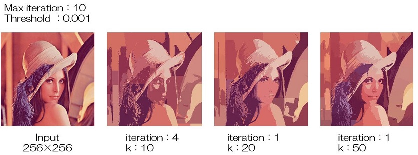

# SLIC
SLIC(Simple Linear Iterative Clustering) 再現実装

スーパーピクセルを生成するSLIC([元論文](https://core.ac.uk/download/pdf/147983593.pdf))(2012年)の実装です。

</img>

## SLICとは
セグメンテーション手法の1つ。各ピクセルの色や特徴の類似度から複数のピクセルをまとめたスーパーピクセルを生成。k-meansをスーパーピクセル生成に応用した手法。

## アルゴリズム
0. RGB表色系からLab表色系に変換
1. k個の重心を画像に均等配置(kはユーザーが指定)
2. 勾配に基づいて重心位置を調整
3. 最大イテレーション数もしくはマンハッタン距離で計算した重心移動量が閾値以下になるまで以下の処理を続ける
4. 画像全体ではなく、局所的な範囲で重心とピクセルの距離に基づくk-meansを適用。ただし、距離計算は色と位置、スーパーピクセルの大きさを考慮する。
5. クラスタに含まれる全てのピクセルの色と位置の平均値から新たな重心を計算し、重心を移動

## 実装
- 再現実装     [slic.py](slic.py)<br>
主にPythonとNumpyを用いて実装

- OpenCVを用いた実装     [slic_cv.py](slic_cv.py)<br>
[Qiita：OpenCVのスーパーピクセル](https://qiita.com/sitar-harmonics/items/ba02cd14d6f362439e96)を参考に実装

## 解説
解説資料のpdfを公開しました
[解説資料](explanation.pdf)

ざっくりとした解説をZennに公開しました
[スーパーピクセル SLIC を学んでみた](https://zenn.dev/textcunma/articles/a969ebcc5f08d6)

## 結果

</img>

## 仮想環境
``` bash
conda env create --file env.yml
```
- Python: 3.8.13
- Numpy: 1.23.0
- OpenCV: 4.5.5

## 改善
- RGBからLabに変換する際に並列処理からnp.vectorizeに変更。約1.15倍高速になる

## 参考サイト
【RGB表色系からLab表色系に変換】
- [pythonで画像RGB-> Labを変換します](https://www.web-dev-qa-db-ja.com/ja/python/python%E3%81%A7%E7%94%BB%E5%83%8Frgbgt-lab%E3%82%92%E5%A4%89%E6%8F%9B%E3%81%97%E3%81%BE%E3%81%99/1070682920/)
- [その他の画像変換](http://opencv.jp/opencv-2.2/cpp/imgproc_miscellaneous_image_transformations.html)
- [色空間の変換(3)  XYZ-Lab 変換](https://fujiwaratko.sakura.ne.jp/infosci/colorspace/colorspace3.html)

【SLIC】
- [SLIC Superpixels Compared to State-of-the-art Superpixel Methods](https://core.ac.uk/download/pdf/147983593.pdf)
- [Pythonで実装する画像認識アルゴリズム SLIC 入門](https://techblog.nhn-techorus.com/archives/7793)
- [Superpixel SLIC のお話(実装編)](https://snowtanuki.hatenablog.jp/entry/2019/04/17/230556)
- [OpenCVのスーパーピクセル](https://qiita.com/sitar-harmonics/items/ba02cd14d6f362439e96)
- [What is the difference between opencv ximgproc.slic and skimage segmentation.slic?](https://stackoverflow.com/questions/57039504/what-is-the-difference-between-opencv-ximgproc-slic-and-skimage-segmentation-sli)